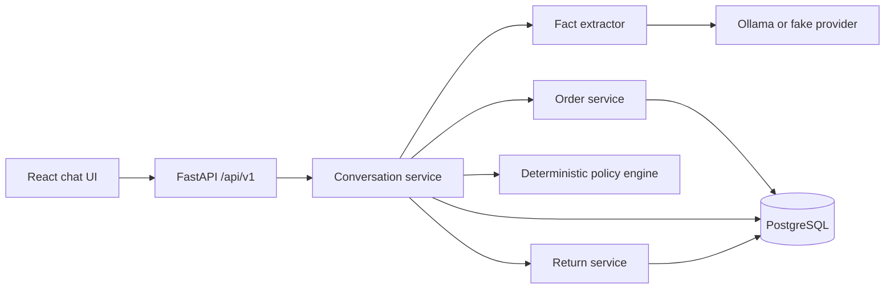

# ReturnFlow architecture

ReturnFlow is a modular monolith. Natural-language extractors may propose facts, but only the
deterministic policy engine makes eligibility decisions and only application services write data.

## Trust boundaries

- User messages, selected labels, and model output are untrusted.
- The server validates question ownership, status, expiry, allowed values, and case version.
- The model never creates policy decisions, SQL, or database mutations.
- A return request is created only after a version-bound confirmation question is answered.

## State progression

`started -> awaiting_user -> eligible -> awaiting_user -> return_created`

Terminal alternatives are `closed`, `escalated`, and `cancelled`. Pending questions are persisted;
an HTTP request never waits for the customer.

